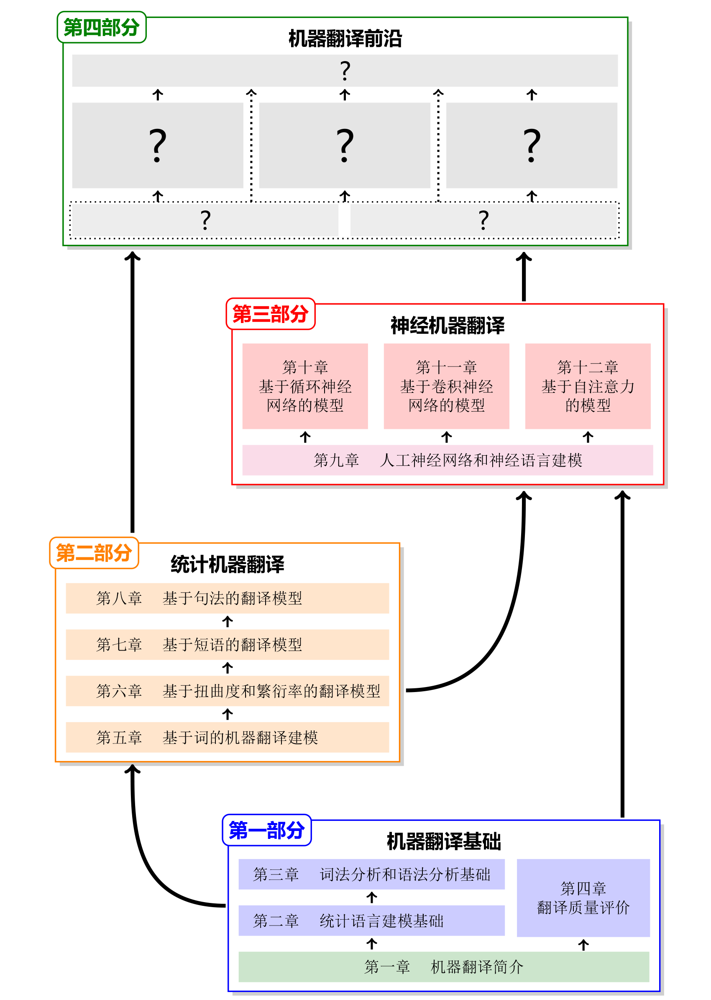

# **机器翻译：基础与模型**
# **Machine Translation: Foundations and Models**

*作者：肖桐 (Tong Xiao)*    *朱靖波 (Jingbo Zhu)*

*单位：东北大学自然语言处理实验室 (NEUNLPLab) / 小牛翻译 (NiuTrans Research)*

*顾问：姚天顺 (Tianshun Yao)*    *王宝库 (Baoku Wang)*

*网站：*[https://opensource.niutrans.com/mtbook/homepage.html](https://opensource.niutrans.com/mtbook/homepage.html)

*GitHub：*[https://github.com/NiuTrans/MTBook](https://github.com/NiuTrans/MTBook)

*百度网盘：* [https://pan.baidu.com/s/160IC_87Hhg_ZNGv65Rutow](https://pan.baidu.com/s/160IC_87Hhg_ZNGv65Rutow) 提取码：MTBK 
</div>

:sunny: **谢谢大家的关注，完整版来了！** :grin:

这是一个教程，目的是对机器翻译的统计建模和深度学习方法进行较为系统的介绍（前身为《机器翻译：统计建模与深度学习方法》）。其内容被编纂成书，可以供计算机相关专业高年级本科生及研究生学习之用，亦可作为自然语言处理，特别是机器翻译相关研究人员的参考资料。本书用tex编写，所有源代码均已开放。

本书共分为四个部分，每部分由若干章节组成，章节的顺序参考了机器翻译技术发展的时间脉络，同时兼顾了机器翻译知识体系的内在逻辑。各部分的主要关系如下（如果无法显示图片可以稍后再试）：

<div align="center">
<!--  -->

</div>

## 内容

<a href="https://opensource.niutrans.com/mtbook/coverpage.html" title="封面、前言和目录">封面、前言和目录</a>

**Part I 机器翻译基础**

1. 机器翻译简介
  * <a href="https://opensource.niutrans.com/mtbook/section1-1.html" title="机器翻译的概念">1.1 机器翻译的概念</a>
  * <a href="https://opensource.niutrans.com/mtbook/section1-2.html" title="机器翻译简史">1.2 机器翻译简史</a>
  * <a href="https://opensource.niutrans.com/mtbook/section1-3.html" title="机器翻译现状及挑战">1.3 机器翻译现状及挑战</a>
  * <a href="https://opensource.niutrans.com/mtbook/section1-4.html" title="基于规则的方法">1.4 基于规则的方法</a>
  * <a href="https://opensource.niutrans.com/mtbook/section1-5.html" title="数据驱动的方法">1.5 数据驱动的方法</a>
  * <a href="https://opensource.niutrans.com/mtbook/section1-6.html" title="推荐学习资源">1.6 推荐学习资源</a>

2. 统计语言建模基础
  * <a href="https://opensource.niutrans.com/mtbook/section2-1.html" title="概率论基础">2.1 概率论基础</a>
  * <a href="https://opensource.niutrans.com/mtbook/section2-2.html" title="掷骰子游戏">2.2 掷骰子游戏</a>
  * <a href="https://opensource.niutrans.com/mtbook/section2-3.html" title="n-gram 语言模型">2.3 *n*-gram 语言模型</a>
  * <a href="https://opensource.niutrans.com/mtbook/section2-4.html" title="预测与搜索">2.4 预测与搜索</a>
  * <a href="https://opensource.niutrans.com/mtbook/section2-5.html" title="小结及拓展阅读">2.5 小结及拓展阅读</a>

3. 词法分析和语法分析基础
  * <a href="https://opensource.niutrans.com/mtbook/section3-1.html" title="问题概述">3.1 问题概述</a>
  * <a href="https://opensource.niutrans.com/mtbook/section3-2.html" title="中文分词">3.2 中文分词</a>
  * <a href="https://opensource.niutrans.com/mtbook/section3-3.html" title="命名实体识别">3.3 命名实体识别</a>
  * <a href="https://opensource.niutrans.com/mtbook/section3-4.html" title="句法分析（短语结构分析）">3.4 句法分析（短语结构分析）</a>
  * <a href="https://opensource.niutrans.com/mtbook/section3-5.html" title="小结及拓展阅读">3.5 小结及拓展阅读</a>

4. 翻译质量评价
  * <a href="https://opensource.niutrans.com/mtbook/section4-1.html" title="译文质量评价所面临的挑战">4.1 译文质量评价所面临的挑战</a>
  * <a href="https://opensource.niutrans.com/mtbook/section4-2.html" title="人工评价">4.2 人工评价</a>
  * <a href="https://opensource.niutrans.com/mtbook/section4-3.html" title="有参考答案的自动评价">4.3 有参考答案的自动评价</a>
  * <a href="https://opensource.niutrans.com/mtbook/section4-4.html" title="无参考答案的自动评价">4.4 无参考答案的自动评价</a>
  * <a href="https://opensource.niutrans.com/mtbook/section4-5.html" title="小结及拓展阅读">4.5 小结及拓展阅读</a>

**Part II 统计机器翻译**

5.  基于词的机器翻译建模
  * <a href="https://opensource.niutrans.com/mtbook/section5-1.html" title="词在翻译中的作用">5.1 词在翻译中的作用</a>
  * <a href="https://opensource.niutrans.com/mtbook/section5-2.html" title="一个简单实例">5.2 一个简单实例</a>
  * <a href="https://opensource.niutrans.com/mtbook/section5-3.html" title="噪声信道模型">5.3 噪声信道模型</a>
  * <a href="https://opensource.niutrans.com/mtbook/section5-4.html" title="统计机器翻译的三个基本问题">5.4 统计机器翻译的三个基本问题</a>
  * <a href="https://opensource.niutrans.com/mtbook/section5-5.html" title="IBM 模型1">5.5 IBM 模型1</a>
  * <a href="https://opensource.niutrans.com/mtbook/section5-6.html" title="小结及拓展阅读">5.6 小结及拓展阅读</a>

6.  基于扭曲度和繁衍率的模型
  * <a href="https://opensource.niutrans.com/mtbook/section6-1.html" title="基于扭曲度的模型">6.1 基于扭曲度的模型</a>
  * <a href="https://opensource.niutrans.com/mtbook/section6-2.html" title="基于繁衍率的模型">6.2 基于繁衍率的模型</a>
  * <a href="https://opensource.niutrans.com/mtbook/section6-3.html" title="解码和训练">6.3 解码和训练</a>
  * <a href="https://opensource.niutrans.com/mtbook/section6-4.html" title="问题分析">6.4 问题分析</a>
  * <a href="https://opensource.niutrans.com/mtbook/section6-5.html" title="小结及拓展阅读">6.5 小结及拓展阅读</a>

7.  基于短语的模型
  * <a href="https://opensource.niutrans.com/mtbook/section7-1.html" title="翻译中的短语信息">7.1 翻译中的短语信息</a>
  * <a href="https://opensource.niutrans.com/mtbook/section7-2.html" title="数学建模">7.2 数学建模</a>
  * <a href="https://opensource.niutrans.com/mtbook/section7-3.html" title="短语抽取">7.3 短语抽取</a>
  * <a href="https://opensource.niutrans.com/mtbook/section7-4.html" title="翻译调序建模">7.4 翻译调序建模</a>
  * <a href="https://opensource.niutrans.com/mtbook/section7-5.html" title="翻译特征">7.5 翻译特征</a>
  * <a href="https://opensource.niutrans.com/mtbook/section7-6.html" title="最小错误率训练">7.6 最小错误率训练</a>
  * <a href="https://opensource.niutrans.com/mtbook/section7-7.html" title="栈解码">7.7 栈解码</a>
  * <a href="https://opensource.niutrans.com/mtbook/section7-8.html" title="小结及拓展阅读">7.8 小结及拓展阅读</a>

8.  基于句法的模型
  * <a href="https://opensource.niutrans.com/mtbook/section8-1.html" title="翻译中句法信息的使用">8.1 翻译中句法信息的使用</a>
  * <a href="https://opensource.niutrans.com/mtbook/section8-2.html" title="基于层次短语的模型">8.2 基于层次短语的模型</a>
  * <a href="https://opensource.niutrans.com/mtbook/section8-3.html" title="基于语言学句法的模型">8.3 基于语言学句法的模型</a>
  * <a href="https://opensource.niutrans.com/mtbook/section8-4.html" title="小结及拓展阅读">8.4 小结及拓展阅读</a>

**Part III 神经机器翻译**

9.  人工神经网络和神经语言建模
  * <a href="https://opensource.niutrans.com/mtbook/section9-1.html" title="深度学习与人工神经网络">9.1 深度学习与人工神经网络</a>
  * <a href="https://opensource.niutrans.com/mtbook/section9-2.html" title="神经网络基础">9.2 神经网络基础</a>
  * <a href="https://opensource.niutrans.com/mtbook/section9-3.html" title="神经网络的张量实现">9.3 神经网络的张量实现</a>
  * <a href="https://opensource.niutrans.com/mtbook/section9-4.html" title="神经网络的参数训练">9.4 神经网络的参数训练</a>
  * <a href="https://opensource.niutrans.com/mtbook/section9-5.html" title="神经语言模型">9.5 神经语言模型</a>
  * <a href="https://opensource.niutrans.com/mtbook/section9-6.html" title="小结及拓展阅读">9.6 小结及拓展阅读</a>

10.  基于循环神经网络的模型
* <a href="https://opensource.niutrans.com/mtbook/section10-1.html" title="神经机器翻译的发展简史">10.1 神经机器翻译的发展简史</a>
* <a href="https://opensource.niutrans.com/mtbook/section10-2.html" title="编码器-解码器框架">10.2 编码器-解码器框架</a>
* <a href="https://opensource.niutrans.com/mtbook/section10-3.html" title="基于循环神经网络的翻译建模">10.3 基于循环神经网络的翻译建模</a>
* <a href="https://opensource.niutrans.com/mtbook/section10-4.html" title="注意力机制">10.4 注意力机制</a>
* <a href="https://opensource.niutrans.com/mtbook/section10-5.html" title="训练及推断">10.5 训练及推断</a>
* <a href="https://opensource.niutrans.com/mtbook/section10-6.html" title="小结及拓展阅读">10.6 小结及拓展阅读</a>

11.  基于卷积神经网络的模型
  * <a href="https://opensource.niutrans.com/mtbook/section11-1.html" title="卷积神经网络">11.1 卷积神经网络</a>
  * <a href="https://opensource.niutrans.com/mtbook/section11-2.html" title="基于卷积神经网络的翻译建模">11.2 基于卷积神经网络的翻译建模</a>
  * <a href="https://opensource.niutrans.com/mtbook/section11-3.html" title="局部模型的改进">11.3 局部模型的改进</a>
  * <a href="https://opensource.niutrans.com/mtbook/section11-4.html" title="小结及拓展阅读">11.4 小结及拓展阅读</a>

12.  基于自注意力的模型
  * <a href="https://opensource.niutrans.com/mtbook/section12-1.html" title="自注意力机制">12.1 自注意力机制</a>
  * <a href="https://opensource.niutrans.com/mtbook/section12-2.html" title="Transformer 架构">12.2 Transformer 架构</a>
  * <a href="https://opensource.niutrans.com/mtbook/section12-3.html" title="位置编码">12.3 位置编码</a>
  * <a href="https://opensource.niutrans.com/mtbook/section12-4.html" title="基于点乘的多头注意力机制">12.4 基于点乘的多头注意力机制</a>
  * <a href="https://opensource.niutrans.com/mtbook/section12-5.html" title="残差网络和层标准化">12.5 残差网络和层标准化</a>
  * <a href="https://opensource.niutrans.com/mtbook/section12-6.html" title="前馈全连接网络子层">12.6 前馈全连接网络子层</a>
  * <a href="https://opensource.niutrans.com/mtbook/section12-7.html" title="训练">12.7 训练</a>
  * <a href="https://opensource.niutrans.com/mtbook/section12-8.html" title="推断">12.8 推断</a>
  * <a href="https://opensource.niutrans.com/mtbook/section12-9.html" title="小结及拓展阅读">12.9 小结及拓展阅读</a>

**Part IV 机器翻译前沿**

13. 神经机器翻译模型训练
* <a href="https://opensource.niutrans.com/mtbook/section13-1.html" title="开放词表">13.1 开放词表</a>
* <a href="https://opensource.niutrans.com/mtbook/section13-2.html" title="正则化">13.2 正则化</a>
* <a href="https://opensource.niutrans.com/mtbook/section13-3.html" title="对抗样本训练">13.3 对抗样本训练</a>
* <a href="https://opensource.niutrans.com/mtbook/section13-4.html" title="学习策略">13.4 学习策略</a>
* <a href="https://opensource.niutrans.com/mtbook/section13-5.html" title="知识蒸馏">13.5 知识蒸馏</a>
* <a href="https://opensource.niutrans.com/mtbook/section13-6.html" title="基于样本价值的学习">13.6 基于样本价值的学习</a>
* <a href="https://opensource.niutrans.com/mtbook/section13-7.html" title="小结及拓展阅读">13.7 小结及拓展阅读</a>

14. 神经机器翻译模型推断
* <a href="https://opensource.niutrans.com/mtbook/section14-1.html" title="面临的挑战">14.1 面临的挑战</a>
* <a href="https://opensource.niutrans.com/mtbook/section14-2.html" title="基本问题">14.2 基本问题</a>
* <a href="https://opensource.niutrans.com/mtbook/section14-3.html" title="轻量模型">14.3 轻量模型</a>
* <a href="https://opensource.niutrans.com/mtbook/section14-4.html" title="=非自回归翻译">14.4 非自回归翻译</a>
* <a href="https://opensource.niutrans.com/mtbook/section14-5.html" title="多模型集成">14.5 多模型集成</a>
* <a href="https://opensource.niutrans.com/mtbook/section14-6.html" title="小结及拓展阅读">14.6 小结及拓展阅读</a>

15. 神经机器翻译结构优化
  * <a href="https://opensource.niutrans.com/mtbook/section15-1.html" title="注意力机制的改进">15.1 注意力机制的改进</a>
  * <a href="https://opensource.niutrans.com/mtbook/section15-2.html" title="神经网络连接优化及深层模型">15.2 神经网络连接优化及深层模型</a>
  * <a href="https://opensource.niutrans.com/mtbook/section15-3.html" title="基于句法的神经机器翻译模型">15.3 基于句法的神经机器翻译模型</a>
  * <a href="https://opensource.niutrans.com/mtbook/section15-4.html" title="基于结构搜索的翻译模型优化">15.4 基于结构搜索的翻译模型优化</a>
  * <a href="https://opensource.niutrans.com/mtbook/section15-5.html" title="小结及拓展阅读">15.5 小结及拓展阅读</a>

16. 低资源神经机器翻译 
* <a href="https://opensource.niutrans.com/mtbook/section16-1.html" title="数据的有效使用">16.1 数据的有效使用</a>
* <a href="https://opensource.niutrans.com/mtbook/section16-2.html" title="双向翻译模型">16.2 双向翻译模型</a>
* <a href="https://opensource.niutrans.com/mtbook/section16-3.html" title="多语言翻译模型">16.3 多语言翻译模型</a>
* <a href="https://opensource.niutrans.com/mtbook/section16-4.html" title="无监督机器翻译">16.4 无监督机器翻译</a>
* <a href="https://opensource.niutrans.com/mtbook/section16-5.html" title="领域适应">16.5 领域适应</a>
* <a href="https://opensource.niutrans.com/mtbook/section16-6.html" title="小结及拓展阅读">16.6 小结及拓展阅读</a>
  
17. 多模态、多层次机器翻译 
* <a href="https://opensource.niutrans.com/mtbook/section17-1.html" title="机器翻译需要更多的上下文">17.1 机器翻译需要更多的上下文</a>
* <a href="https://opensource.niutrans.com/mtbook/section17-2.html" title="语音翻译">17.2 语音翻译</a>
* <a href="https://opensource.niutrans.com/mtbook/section17-3.html" title="图像翻译">17.3 图像翻译</a>
* <a href="https://opensource.niutrans.com/mtbook/section17-4.html" title="篇章级翻译">17.4 篇章级翻译</a>
* <a href="https://opensource.niutrans.com/mtbook/section17-5.html" title="小结及拓展阅读">17.5 小结及拓展阅读</a>
  
18. 机器翻译应用技术
  * <a href="https://opensource.niutrans.com/mtbook/section18-1.html" title="机器翻译的应用并不简单">18.1 机器翻译的应用并不简单</a>
  * <a href="https://opensource.niutrans.com/mtbook/section18-2.html" title="增量式模型优化">18.2 增量式模型优化</a>
  * <a href="https://opensource.niutrans.com/mtbook/section18-3.html" title="交互式机器翻译">18.3 交互式机器翻译</a>
  * <a href="https://opensource.niutrans.com/mtbook/section18-4.html" title="翻译结果的可干预性">18.4 翻译结果的可干预性</a>
  * <a href="https://opensource.niutrans.com/mtbook/section18-5.html" title="小设备机器翻译">18.5 小设备机器翻译</a>
  * <a href="https://opensource.niutrans.com/mtbook/section18-6.html" title="机器翻译系统的部署">18.6 机器翻译系统的部署</a>
  * <a href="https://opensource.niutrans.com/mtbook/section18-7.html" title="机器翻译的应用场景">18.7 机器翻译的应用场景</a>

**<a href="https://opensource.niutrans.com/mtbook/postscript.html" title="随笔">随笔</a>**

**Part V 附录**

* <a href="https://opensource.niutrans.com/mtbook/appendix-a.html" title="附录 A">附录 A：开源机器翻译系统</a>
* <a href="https://opensource.niutrans.com/mtbook/appendix-b.html" title="附录 B">附录 B：评测任务及基准数据集</a>
* <a href="https://opensource.niutrans.com/mtbook/appendix-c.html" title="附录 C">附录 C：IBM模型2-5训练方法</a>

**<a href="https://opensource.niutrans.com/mtbook/references.html" title="参考文献">参考文献</a>**

**<a href="https://opensource.niutrans.com/mtbook/index.html" title="索引">索引</a>**

注：本书的pdf版本可以从GitHub仓库获取[https://github.com/NiuTrans/MTBook/blob/master/mt-book.pdf](https://github.com/NiuTrans/MTBook/blob/master/mt-book.pdf)

## 源代码


本书的tex源代码地址为：[https://github.com/NiuTrans/MTBook](https://github.com/NiuTrans/MTBook)

编译前需要安装[MikTeX](https://miktex.org/)，并在MikTeX Console中下载并更新编译所需宏包。之后，编译src目录下的mt-book-xelatex.tex即可得到pdf文件，编译指令如下：

```shell
xelatex mt-book-xelatex
biber mt-book-xelatex
makeindex mt-book-xelatex
xelatex mt-book-xelatex
```

在编译中可能会遇到内存不足的问题，可以通过以下方式解决：
#### Windows下使用MiKTeX或CTEX
1. 运行cmd打开命令行窗口，输入：`initexmf --edit-config-file=xelatex`

2. 在弹出的文件中输入以下内容：`main_memory=5000000 extra_mem_bot=5000000  font_mem_size=5000000 pool_size=5000000 buf_size=5000000`

3. 在cmd窗口输入： `initexmf --dump=xelatex` 更新latex格式文件

#### TeXLive & MacTeX（Linux，OS X等）

1. 打开texmf.cnf文件，更改其内容为：`main_memory=5000000 extra_mem_bot=5000000 font_mem_size=5000000 pool_size=5000000 buf_size=5000000`

2. 调用texhash更新latex格式文件

注：编译tex文件会依赖一些宏包。如果有任何编译错误，建议将宏包更新至最新版本。

## 课件

本教程部分章节的课件已开放（我们对有些章节进行了合并）。pdf版本的地址为[https://github.com/NiuTrans/MTBook/tree/master/slides](https://github.com/NiuTrans/MTBook/tree/master/slides)

## 开源协议

本书的开源内容基于The Creative Commons Attribution-NonCommercial 4.0 Unported License（[link](https://creativecommons.org/licenses/by-nc/4.0)）

## 更新历史

2021年2月1日   《机器翻译：模型与基础》，完整版 V0.3

2020年12月1日  《机器翻译：模型与基础》（更名后），基础篇 V0.2

2020年5月21日  《机器翻译：统计建模与深度学习方法》，第一版 V0.1

## 致谢

感谢为本书做出贡献的小牛团队（部分）成员

*曹润柘、曾信、孟霞、单韦乔、周涛、周书含、许诺、李北、许晨、林野、李垠桥、王子扬、刘辉、张裕浩、冯凯、罗应峰、魏冰浩、王屹超、李炎洋、胡驰、姜雨帆、田丰宁、刘继强、张哲旸、陈贺轩、牛蕊、杜权、张春良、王会珍、张俐、马安香、胡明涵*

## 联系我们

有任何问题请联系xiaotong [at] mail.neu.edu.cn （肖桐） 或 854581319 [at] qq.com（曹润柘）
